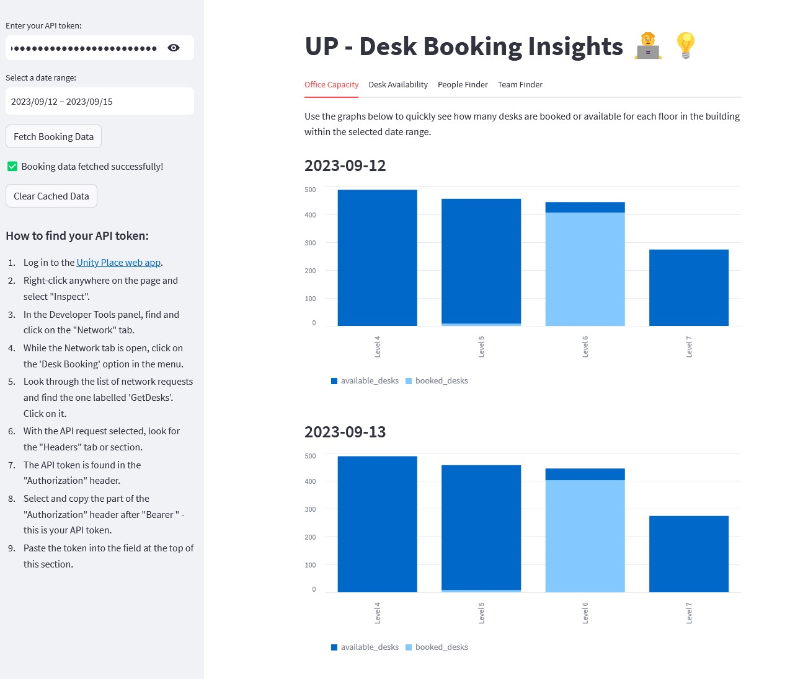

# UP - Desk Booking Insights

## Description

This Streamlit app provides insights into desk booking data for Unity Place, leveraging the Unity Place API to fetch real-time data. Users can find detailed information on office capacity, desk availability, and the whereabouts of team members over a specified date range.



## Background

The UP - Desk Booking Insights app was developed to extend the functionality of the Unity Place desk booking system, providing a more efficient and user-friendly experience for individuals working in the office. The app centralises critical functionalities, offering a streamlined approach to viewing and managing desk bookings.

### Key Benefits
- **Time-Saving**: Avoid the need to flip through each day separately to find available desks.
- **Coordination**: Easily coordinate desk locations for meetings or collaborative projects by finding open desks near your teammates.
- **Convenience**: Swiftly locate open desks near your team members to facilitate communication and collaboration.
- **Efficiency**: The app optimises performance by making a single API call per day to retrieve that day's booking data. All subsequent views and filters process within the app using the cached data, thus preventing repetitive API calls as you navigate through different features.


## Installation

### Local Installation

1. Ensure you have Python 3.8 or later installed. You can download it from [here](https://www.python.org/).
2. Clone this repository or download the source code.
3. Open a terminal and navigate to the project's root directory (where the `requirements.txt` file is located).
4. Run the command `pip install -r requirements.txt` to install the necessary Python packages.

### Access Online

You can also try out the app without installation on the [Streamlit Community Cloud](https://deskbookings.streamlit.app).

## Usage

1. In the terminal, run the command `streamlit run app.py` to launch the app (for local installation).
2. Open a web browser and navigate to [http://localhost:8501](http://localhost:8501) to access the app.
3. Follow the instructions in the app to find your API token and input it in the designated field.
4. Use the various features in the app to gain insights into desk booking data:

   - **Office Capacity**: [Details on what this tab does]
   - **Desk Availability**: [Details on what this tab does]
   - **People Finder**: Find and check the desk bookings of specific individuals.
   - **Team Finder**: Upload a CSV file with a list of team members to check their desk bookings.

### Note on CSV File Format for Team Finder

The CSV file must contain a single column of names with no header row, and each name should be followed by a comma. For example:

```
Elon Musk,
Jeff Bezos,
Bill Gates,
```

## Contribution

This app is in its first release and will be actively developed to incorporate user feedback during initial testing. I welcome contributions and feedback to help improve the app. Feel free to fork the repository and submit pull requests for any enhancements or bug fixes.

## License

MIT License

## Contact

If you have any questions, concerns, or feedback, please raise an issue on [GitHub](https://github.com/mrwadams/up-desk-booking).
